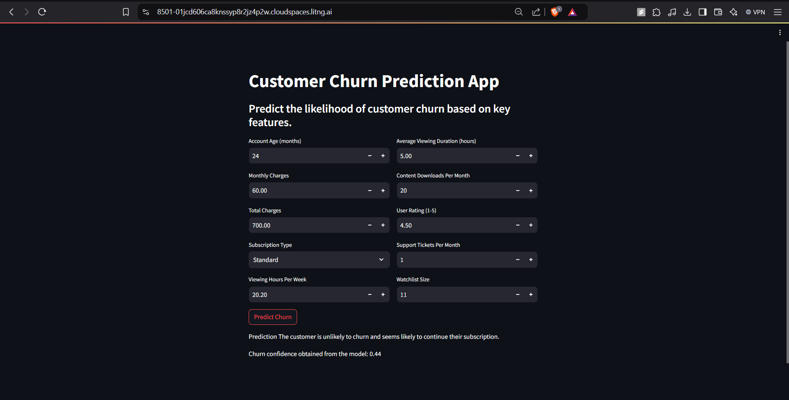

# Customer Churn Prediction Using LightGBM Model 📉

This repository presents a comprehensive machine learning solution for customer churn prediction, designed to help businesses identify at-risk customers and proactively optimize retention strategies. The project employs a tuned LightGBM model within a tailored data pipeline, effectively handling class imbalance through SMOTE and engineering features to improve model performance.

This project showcases an end-to-end, production-ready approach to churn modeling, highlighting skills in model optimization, and deploying interactive machine learning applications—ideal for demonstrating expertise in building impactful, business-driven ML solutions.

---

## Project Notebook 📓

Explore the code and methodology in the [Google Colab Notebook](https://colab.research.google.com/drive/1wN07WXLO-mUPvVJQV64q-6casNfe3lZv?usp=sharing). This notebook includes all the steps for data preprocessing, feature engineering, model training, and evaluation.

---

## Web Application 🖥️

  
*Streamlit interface that allows for interactive customer churn predictions.*

---

## Approach and Steps 🛠️

1. **Data Preprocessing**: 
   - Created new features (`CustomerTenureEngagement`, `ContentConsumptionScore`) to improve model accuracy.
   - Encoded `SubscriptionType` using ordinal encoding and applied one-hot encoding to other categorical features.
   - Handled outliers and skewness with Winsorization and log transformations.

2. **Model Training**: 
   - Utilized LightGBM for its efficiency with large datasets 
   - Addressed class imbalance with SMOTE to improve recall for the churn class.
   - Tuned hyperparameters with GridSearchCV to optimize recall and F1 score.

3. **Deployment**: 
   - Built a Streamlit app for churn predictions, processing user inputs through the full pipeline to deliver customer-specific churn probabilities.

---

## How to Run the Streamlit Application 🚀🚀

Follow these steps to set up and run the application locally:

### Step 1: Clone the Repository
First, clone the repository and navigate to the project directory:
```bash
git clone https://github.com/Parag000/Customer-Churn-Prediction.git
cd customer-churn-prediction
```

### Step 2: Set Up Environment and Install Dependencies
```bash
python -m venv venv
source venv/bin/activate  # For Linux/MacOS
venv\Scripts\activate  # For Windows

pip install -r requirements.txt
```

### Step 3: Download Model and Pipeline Files
Download the following files and place them in the project root:

- smote_lgbm.pkl: The pre-trained LightGBM model.
- preprocessing_pipeline.pkl: The custom preprocessing pipeline.
These files are be provided as part of the repository assets.

### Step 4: Run the Streamlit App
Start the Streamlit application by running:
```bash
streamlit run app.py
```
This will open the application in your web browser
